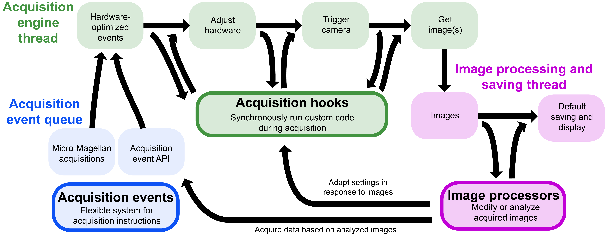

******************************************************
Acquisitions 
******************************************************

The :class:`Acquisition<pycromanager.Acquisition>` class is a powerful abstraction that can be used for a wide range of microscopy workflows. An :class:`Acquisition<pycromanager.Acquisition>` can be run when the Micro-Manager GUI is already open, or they can be launched without the Micro-Manager GUI using :ref:`headless_mode`. By turning off the pycromanager's default image viewer, the :class:`Acquisition<pycromanager.Acquisition>` class can be used as a data acquisition backend for custom applications.

Each type of :class:`Acquisition<pycromanager.Acquisition>` uses one of several possible mechanisms for :ref:`acq_events`.

More advanced functionality can be implemented through the use of :ref:`acq_hooks`, which are used to modify acquisition control on-the-fly or synchrnoize hardware outside of micro-manager with acquisition, or with :ref:`img_processors`, which can be used to modify images during before saving/display or to divert images away from display/saving to custom endpoints.

The :ref:`performance_guide` describes how to make :class:`Acquisition<pycromanager.Acquisition>` best coding practices and how to use pycromanager with microscopes that use :ref:`hardware_triggering`.

:ref:`reading_data` describes how to read the data acquired by an :class:`Acquisition<pycromanager.Acquisition>` as a ``numpy`` or ``dask`` .

The figure figure below gives an overview of some of the features this class provides.

   **Pycro-Manager's high-level programming interface.** The data acquisition process in Pycro-Manager starts with (blue) a source of acquisition events (from either a programming or GUI). These events are passed to (green) the acquisition engine, which optimizes them to take advantage of hardware triggering where available, sends instructions to hardware, and acquires images. (Magenta) The resulting images are then saved and displayed in the GUI. The three main abstractions of the Pycro-Manager high-level programming interface (acquisition events, acquisition hooks, and image processors) enable fine-grained control and customization of this process.

###############################

.. toctree::
	:maxdepth: 3
	:caption: Contents:

	acq_events
	acq_hooks
	img_processors
	image_saved_callbacks
	headless_mode
	performance_guide
	

