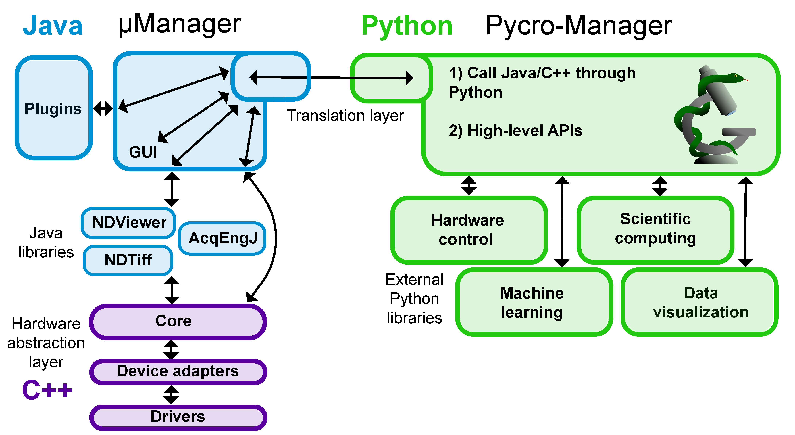
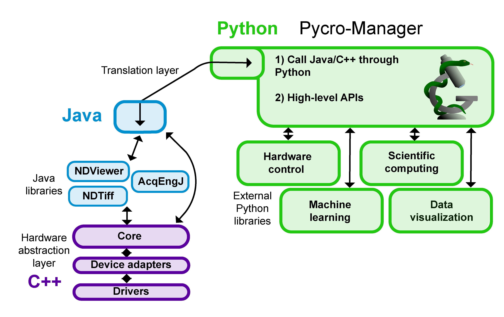

*******************
Advanced Usage
*******************

Advanced use cases may require a deeper understanding of how pycromanager works.

   **Pycro-manager architecture overview** (Purple) The Micro-manager core and device layer abstract the operation of specific hardware devices into a generic API for hardware control. (Blue) The Micro-Manager Java layer contains high performance libraries for hardware control (i.e. the acquisition engine), data saving, and image display, as well as a graphical user interface and plugin interface. (Green) Pycro-Manager calls these Java libraries, and the c++ libraries that sit below them through a "Bridge" that dynamically translates between Java and Python

   **Headless mode (using Java backend)** In headless mode, pycro-manager can be run without the micro-manager user interface, enabling the implementation of custom user interfaces or no user interfaces at all. 

.. toctree::
	:maxdepth: 3
	:caption: Contents:

	performance_guide
	hardware_triggering

