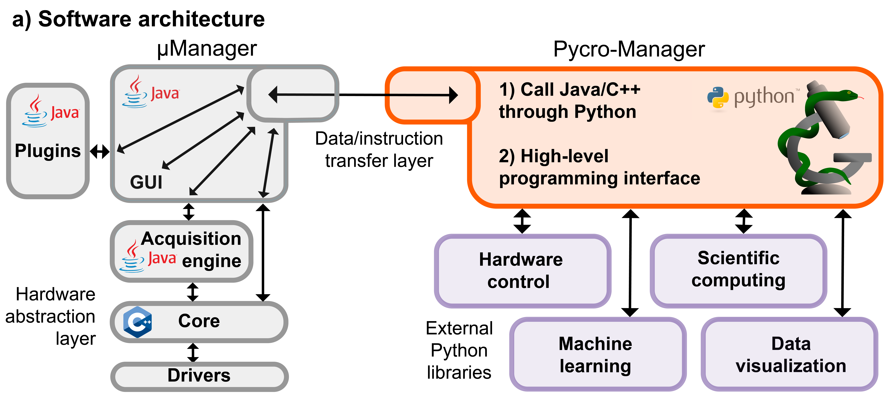

.. image:: pycromanager_banner.png
  :width: 600
  :alt: Alternative text

``pycromanager`` is a multi-purpose python package for the control of microscope hardware and the acquisition of data. It is designed for perfomance and flexibility to be used in a variety of applications. It can be used in parallel with the Micro-Manager desktop application to expand its capabilities, independently of the main Micro-Manager GUI directly from python, with other user interfaces like `Napari <https://napari.org/>`_, or as a backend to custom applications that work on a single machine or across a network.

Information on the original motivations for Pycro-Manager can be found in the `publication <https://rdcu.be/cghwk>`_, though its capabilities have since expanded. 

   **Pycro-manager architecture overview.** (Grey) The existing parts of µManager provide generic microscope control abstracted from specific hardware, a graphical user interface (GUI), a Java plugin interface, and an acquisition engine, which automates various aspects of data collection. (Orange) Pycro-Manager enables access to these components through Python over a network-compatible transport layer, as well as a concise, high-level programming interface for acquiring data. These provide integration of data acquisition with  (purple) Python libraries for hardware control, data visualization, scientific computing, etc. 

.. ***********************
.. :doc:`setup`
.. ***********************

.. ***********************
.. :doc:`features`
.. ***********************

.. ***********************
.. :doc:`applications`
.. ***********************

.. ***********************
.. :doc:`apis`
.. ***********************

.. toctree::
	:maxdepth: 1
	:caption: Contents:

	setup
	features
	applications
	apis
	citation
	

Indices and tables
==================

* :ref:`genindex`
* :ref:`modindex`
* :ref:`search`
