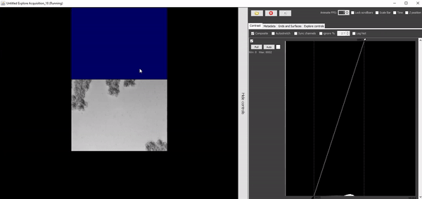

.. _special_acqs:

****************************************************************
Special Acquisition Types
****************************************************************

.. _xy_tiled_acq:

XYTiled Acquisition
========================
Pycro-manager has special support for acquisitions in which multiple images are tiled together to form large, high-resolution images. In this mode, data will automatically be saved in a multi-resolution pyramid, so that it can be efficiently viewed at multiple levels of zoom. These features are also available though `Micro-magellan <https://micro-manager.org/wiki/MicroMagellan>`_, which provides an interactive GUI as well as other higher level features.

.. note::

   In order for this functionality to work, the current configuration must have a correctly calibrated affine transform matrix, which gives the corrspondence between the coordinate systems of the camera and the XY stage. This can be calibrated automatically in Micro-Manager by using the pixel size calibrator (under ``Devices``--``Pixel Size Calibration`` in the Micro-manager GUI).

To use these features, rather than creating an :class:`Acquisition<pycromanager.Acquisition>`, a :class:`XYTiledAcquisition<pycromanager.Acquisition>` will be used. These classes are almost identical, except that :class:`XYTiledAcquisition<pycromanager.Acquisition>` has an additional required argument ``tile_overlap``, which gives the number of pixels by which adjacent tiles will overlap. Different XY fields of view can be acquired adding ``row`` and ``column`` indices in the ``axes`` of the acquisition event.

.. code-block:: python

    from pycromanager import XYTiledAcquisition

    with XYTiledAcquisition(directory='/path/to/saving/dir', name='saving_name', tile_overlap=10) as acq:
        #10 pixel overlap between adjacent tiles

        #acquire a 2 x 1 grid
        acq.acquire({'axes': 
        		{'row': 0, 'col': 0}
        			})
        acq.acquire({'axes':
        		{'row': 1, 'col': 0}
        			})

Explore Acquisitions
========================

Explore acquisitions are XY tiled acquisitions, only with a special graphical user interface that enables a user to control image acquisition directly, as shown in the example below:

.. _magellan_acq_launch:

Micro-Magellan Acquisition
===============================
Another alternative is to launch `Micro-magellan <https://micro-manager.org/wiki/MicroMagellan>`_ acquisitions. These include both regular and `explore acquisitions <https://micro-manager.org/wiki/MicroMagellan#Explore_Acquisitions>`_, which launches an interactive GUI for navigating around a sample in XY and Z and clicking to collect images. 

Micro-Magellan acquisitions can be run using the :class:`MagellanAcquisition<pycromanager.MagellanAcquisition>` class. The class requires as an argument either ``magellan_acq_index`` or ``magellan_explore``. The former corresponds to the position of the acquisition to be launched in the **Acquisition(s)** section of the Micro-Magellan GUI. Passing in 0 corresponds to the default acquisition. Greater numbers can be used to programatically control multiple acquisitions. The latter corresponds to explore acquisitions, which can be launched by setting the ``magellan_explore`` argument equal to ``True``.

.. code-block:: python

	from pycromanager import MagellanAcquisition

	# no need to use the normal "with" syntax because these acquisition are cleaned up automatically
	acq = MagellanAcquisition(magellan_acq_index=0)

	# Or do this to launch an explore acquisition
	acq = MagellanAcquisition(magellan_explore=True)

	# Optional: block here until the acquisition is finished
	acq.await_completion()

Like the other mechanisms for running acquisitions, Micro-Magellan acquisitions can be used with :ref:`acq_hooks` and :ref:`img_processors`.

