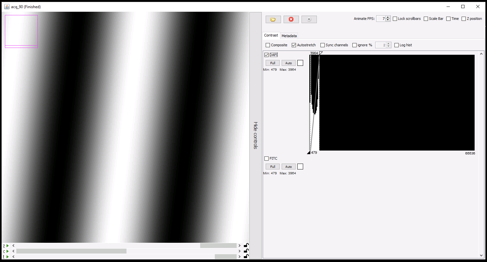
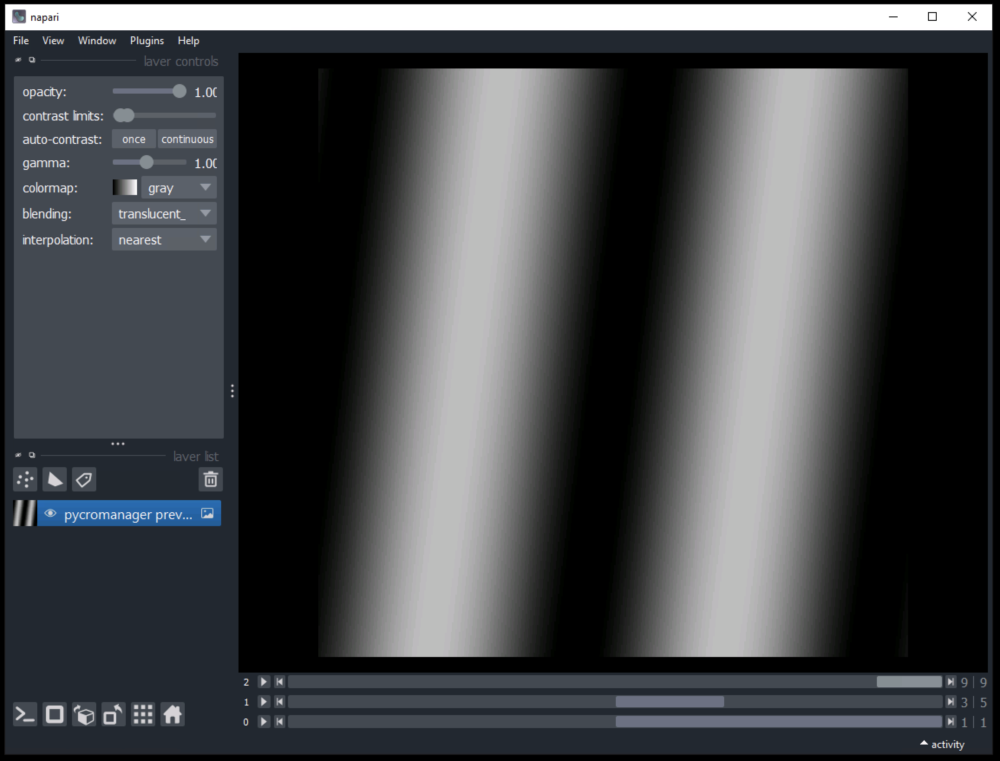

.. _viewers:

**************************
Image viewers
**************************

By default data acquired by ``pycromanager`` is displayed in the Java-based `NDViewer <https://github.com/micro-manager/NDViewer>`_. 

The viewer may be turned off as follows:

.. code-block:: python

	with Acquisition(..., show_display=False) as acq:
	    
	    acq.acquire(events)

Properties of the NDViewer may also be modified through a handle of the java object provided by :meth:`get_viewer<pycromanager.Acquisition.get_viewer>`:

.. code-block:: python

    with Acquisition(..., show_display=True) as acq:

        acq.acquire(events)  # start data acquisition
        viewer = acq.get_viewer()  # get handle of the NDViewer

        # modify viewer properties as needed
    
    viewer.close()  # viewer may be closed at the end of the acquisition

Alternatively, acquired data may be displayed in `napari <https://napari.org/>`_:

.. code-block:: python

    # launch napari viewer
    viewer = napari.Viewer()

    # connect napari viewer to Acquisition class and start data acquisition
    acq = Acquisition(..., napari_viewer=viewer)
    acq.acquire(events)
    acq.mark_finished()

    # start monitoring for acquired data
    napari.run()

    # clean up acquisition once napari window is closed
    acq.await_completion()

